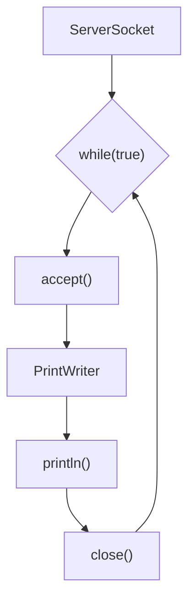
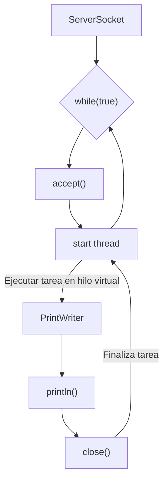
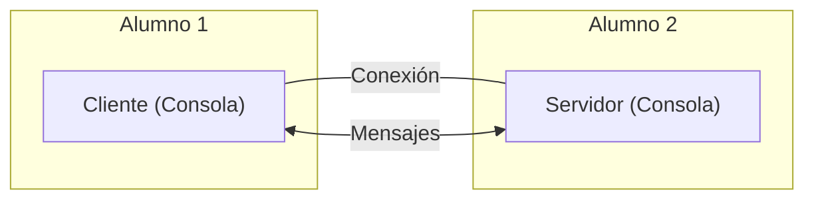
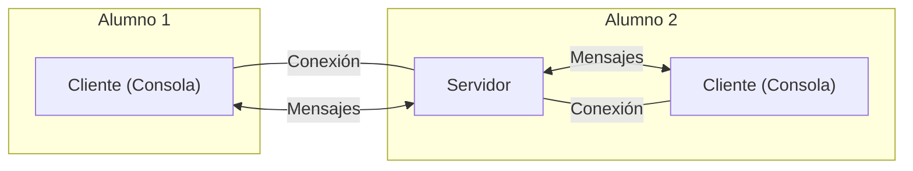
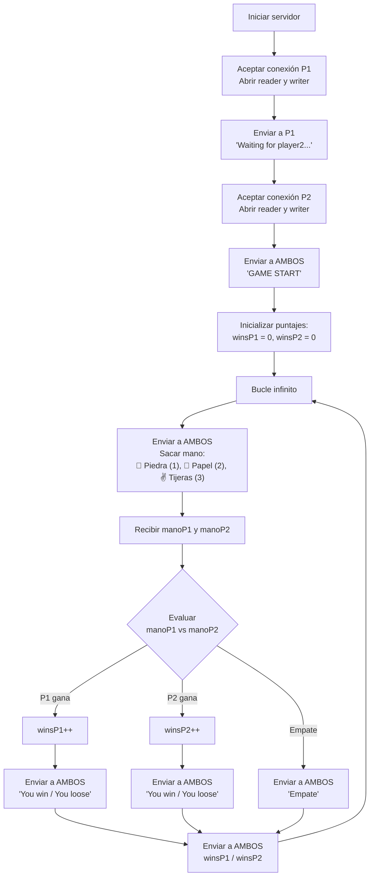
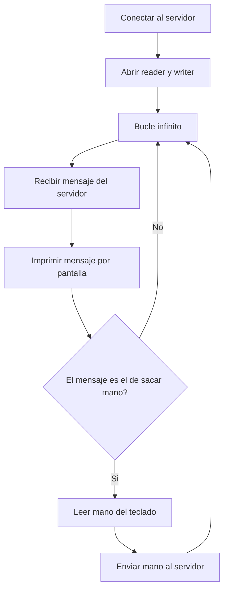

# ServerSocket

* [Exercicis ServerSocket](#exercicis-serversocket)

## Overview

https://docs.oracle.com/en/java/javase/23/docs/api/java.base/java/net/ServerSocket.html

Un socket es un enlace de comunicación bidireccional entre dos programas que ejecutándose en distintas máquinas en una red. 
Cada programa solicita un número de **puerto** al kernel, y de esta forma el kernel conoce a qué programa debe enviar los paquetes, ya que cada paquete lleva asociado un número de puerto al que se envían.

En la arquitectura cliente-servidor, uno de los dos programas hace de servidor: solicita un puerto al kernel, y se queda esperando conexiones de clientes. 
El cliente por su parte, solicita al kernel la conexión con un servidor, y el kernel le asigna un puerto aleatorio.

Para iniciar un servidor en un programa Java se puede usar la clase `java.net.ServerSocket`. Un socket de servidor espera a que lleguen peticiones por la red, y realiza alguna operación en base a dicha petición, retornando possiblemente una respuesta al solicitante.


### 🌐 Iniciar un servidor

Se crea una instancia de `ServerSocket` pasando el número de puerto solicitado. Si el puerto está en uso lanza una excepción. (Los puertos 1 a 1023 se deben solicitar como _root_).

```java
ServerSocket serverSocket = new ServerSocket(8080); 
```

* *El serverSocket debe ser cerrado cuando se desee dejar de aceptar conexiones*.

<br />

### 🌐 Aceptar una conexión

La llamada al método `accept()` bloquea el programa hasta que llegue una conexión de un cliente. Retorna un objeto `Socket` que se puede usar para recibir o enviar datos.

```java
Socket socket = serverSocket.accept();
```

* *El socket debe ser cerrado cuando se desee finalizar la conexión*.

<br />

### 🌐 Escribir datos en el socket (enviar)

Dependiendo del tipo de datos que queramos enviar (bytes, Strings, datos primitivos, objetos, ... ), existen distintos métodos. Para enviar Strings el más común es usar un `PrintWriter`

```java
PrintWriter socketWriter = new PrintWriter(socket.getOutputStream(), true);
socketWriter.println("This is the data");
```
* *El writer debe ser cerrado cuando se desee finalizar la conexión*.

<br />

### 🌐 Leer datos del socket (recibir)

Para leer líneas de texto de un socket se puede usar un `BufferedReader`, así:

```java
var socketReader = new BufferedReader(new InputStreamReader(socket.getInputStream()));

socketReader.lines();     // Stream<String>
socketReader.readLine();  // String
```

* *El reader debe ser cerrado cuando se desee finalizar la conexión*.

<br />

### 🌐 Conectar a un servidor

Un programa **cliente** puede usar la clase `Socket` para iniciar una conexión con un servidor. Hay diversos constructores; uno de ellos es `Socket(String host, int port)`:

```java
Socket socket = new Socket("15.6.17.18", 7000);
```

Una vez establecida la conexión se pueden usar `PrintWriter` o un `BufferedReader` para comunicarse con el servidor.

* *El socket, el writer y el reader deben ser cerrados cuando se desee finalizar la conexión*.
  
<br />

## Exercicis ServerSocket

### 🦫 Exercici 1: Wait, wait, Firefox

Crea un simple servidor con `ServerSocket` que _repetidamente_ accepte una conexión, envie el texto "Hola, mundo", y cierre la conexión.



Prueba el servidor conectando desde Firefox:


Añade un `sleep` de 5 segundos antes de enviar el texto. Luego, conecta desde dos ventanas de Firefox diferentes y comprueba que la primera ventana tarda unos 5 segundos en recibir la respuesta, y la segunda tarda unos 10 segundos.

<br />

### 🦖 Exercici 2: Wait, Firefox

Añade _multithreading_ al ejercicio anterior. Cuando se acepte la conexión de un cliente, el envío de datos se manejará en un _thread_. 



Comprueba que ahora el segundo cliente no debe esperar 10 segundos a recibir una respuesta.

<br />

### 🦇 Exercici 3: Chat Server <-> Client

Programa un chat, _básico_, con tu compañero de clase. Uno de los dos será el servidor y otro el cliente. Ambos, cliente y servidor, deberéis programar algún tipo de mensaje ✨especial✨, que cuando es recibido envia una respuesta automática.



<br />

### 🦇 Exercici 4: Chat Client <-> Server <-> Client

Programa un chat, _algo menos básico_, con tu compañero de clase. 

Los dos seréis clientes, y os comunicaréis a través de un servidor.



<br />

### 👊👋✌️ Exercici 5: Rock, Paper, Network

Programa el juego Piedra-papel-tijeras en red. 
Dos clientes conectaran a un servidor, e iran enviando sus manos. El servidor comprobara quien gana e irá enviando los resultados.

**Servidor:**



**Clientes:**




<br />

## 📝 Pràctica per a l'examen

Aquest apartat conté exercicis tipus examen amb el seu enunciat i una solució completa de referència, per practicar abans de l'avaluació. L'objectiu és que pugues reproduir aquests patrons des de zero: servidor que escolta un port, atenció a múltiples clients amb _threads_, lectura/escriptura amb `BufferedReader` i `PrintWriter`, i tancament correcte de recursos amb _try-with-resources_.

### 🧠 Patró general que has de dominar

**Servidor base (multi-client amb hilos virtuals):**

```java
import java.io.*;
import java.net.*;

public class ServidorBase {
    public static void main(String[] args) throws IOException {
        try (ServerSocket serverSocket = new ServerSocket(PUERTO)) {
            System.out.println("Servidor escuchando en el puerto " + PUERTO);
            while (true) {
                Socket socket = serverSocket.accept();
                Thread.startVirtualThread(() -> atender(socket));
            }
        }
    }

    private static void atender(Socket socket) {
        try (socket;
             BufferedReader in = new BufferedReader(new InputStreamReader(socket.getInputStream()));
             PrintWriter out = new PrintWriter(socket.getOutputStream(), true)) {
            // lógica del protocolo
        } catch (IOException e) {
            System.err.println("Error con cliente: " + e.getMessage());
        }
    }
}
```

**Cliente base:**

```java
import java.io.*;
import java.net.*;
import java.util.Scanner;

public class ClienteBase {
    public static void main(String[] args) throws IOException {
        try (Socket socket = new Socket("localhost", PUERTO);
             BufferedReader in = new BufferedReader(new InputStreamReader(socket.getInputStream()));
             PrintWriter out = new PrintWriter(socket.getOutputStream(), true);
             Scanner sc = new Scanner(System.in)) {
            // lógica del protocolo
        }
    }
}
```

<br />

### 🌡️ Exercici Examen 1 — Conversor de temperatures (4 punts)

Crea un servidor que escolte en el port **9090** i funcione com un conversor de temperatures. El client envia una temperatura en graus Celsius i el servidor respon amb el seu equivalent en Fahrenheit.

**Fórmula:** `F = C × 9/5 + 32`

**Funcionament:**
- El client es connecta i envia un número (ex: `25`).
- El servidor respon amb el resultat (ex: `77.0`).
- El client pot enviar diverses temperatures seguides.
- Si el client envia `salir`, el servidor tanca la connexió amb eixe client i torna a esperar un nou client.

**Eixida esperada al client:**
```
Conectado al servidor.
Introduce temperatura en °C (o "salir"): 25
Resultado: 77.0 °F
Introduce temperatura en °C (o "salir"): 100
Resultado: 212.0 °F
Introduce temperatura en °C (o "salir"): salir
Desconectado.
```

#### ✅ Solució — `ConversionServidor.java`

```java
import java.io.*;
import java.net.*;

public class ConversionServidor {
    private static final int PUERTO = 9090;

    public static void main(String[] args) throws IOException {
        try (ServerSocket serverSocket = new ServerSocket(PUERTO)) {
            System.out.println("Servidor de conversión escuchando en el puerto " + PUERTO);
            while (true) {
                Socket socket = serverSocket.accept();
                System.out.println("Cliente conectado: " + socket.getInetAddress());
                Thread.startVirtualThread(() -> atender(socket));
            }
        }
    }

    private static void atender(Socket socket) {
        try (socket;
             BufferedReader in = new BufferedReader(new InputStreamReader(socket.getInputStream()));
             PrintWriter out = new PrintWriter(socket.getOutputStream(), true)) {

            String linea;
            while ((linea = in.readLine()) != null) {
                if (linea.equalsIgnoreCase("salir")) {
                    break;
                }
                try {
                    double celsius = Double.parseDouble(linea.trim());
                    double fahrenheit = celsius * 9.0 / 5.0 + 32.0;
                    out.println(fahrenheit);
                } catch (NumberFormatException e) {
                    out.println("ERROR: número no válido");
                }
            }
            System.out.println("Cliente desconectado: " + socket.getInetAddress());
        } catch (IOException e) {
            System.err.println("Error con cliente: " + e.getMessage());
        }
    }
}
```

#### ✅ Solució — `ConversionCliente.java`

```java
import java.io.*;
import java.net.*;
import java.util.Scanner;

public class ConversionCliente {
    private static final String HOST = "localhost";
    private static final int PUERTO = 9090;

    public static void main(String[] args) throws IOException {
        try (Socket socket = new Socket(HOST, PUERTO);
             BufferedReader in = new BufferedReader(new InputStreamReader(socket.getInputStream()));
             PrintWriter out = new PrintWriter(socket.getOutputStream(), true);
             Scanner sc = new Scanner(System.in)) {

            System.out.println("Conectado al servidor.");
            while (true) {
                System.out.print("Introduce temperatura en °C (o \"salir\"): ");
                String entrada = sc.nextLine();
                out.println(entrada);

                if (entrada.equalsIgnoreCase("salir")) {
                    System.out.println("Desconectado.");
                    break;
                }

                String respuesta = in.readLine();
                if (respuesta == null) {
                    System.out.println("El servidor cerró la conexión.");
                    break;
                }
                System.out.println("Resultado: " + respuesta + " °F");
            }
        }
    }
}
```

<br />

### 🎯 Exercici Examen 2 — Endevinar un número (6 punts)

Crea un servidor que permeta a diversos clients jugar simultàniament a endevinar un número, cadascun amb la seua pròpia partida independent. El servidor ha d'usar **hilos virtuals** per atendre cada client.

**Funcionament:**
- El servidor escolta en el port **8080**.
- Quan un client es connecta, el servidor genera un número aleatori entre **1 i 100** per a eixe client i li envia: `Adivina un número entre 1 y 100`.
- El client envia un número i el servidor respon:
  - `MAYOR` → el número secret és més gran que l'enviat
  - `MENOR` → el número secret és més menut que l'enviat
  - `ACERTASTE en X intentos` → ha endevinat el número, es tanca la connexió
- Mentre un client juga, altres clients poden connectar-se i jugar la seua pròpia partida a la vegada.

**Eixida esperada al client:**
```
Conectado al servidor.
Adivina un número entre 1 y 100
Tu número: 50
MAYOR
Tu número: 75
MENOR
Tu número: 63
ACERTASTE en 3 intentos
```

#### ✅ Solució — `Servidor.java`

```java
import java.io.*;
import java.net.*;
import java.util.concurrent.ThreadLocalRandom;

public class Servidor {
    private static final int PUERTO = 8080;

    public static void main(String[] args) throws IOException {
        try (ServerSocket serverSocket = new ServerSocket(PUERTO)) {
            System.out.println("Servidor de adivinanza escuchando en el puerto " + PUERTO);
            while (true) {
                Socket socket = serverSocket.accept();
                System.out.println("Cliente conectado: " + socket.getInetAddress());
                Thread.startVirtualThread(() -> jugar(socket));
            }
        }
    }

    private static void jugar(Socket socket) {
        try (socket;
             BufferedReader in = new BufferedReader(new InputStreamReader(socket.getInputStream()));
             PrintWriter out = new PrintWriter(socket.getOutputStream(), true)) {

            int secreto = ThreadLocalRandom.current().nextInt(1, 101);
            int intentos = 0;
            out.println("Adivina un número entre 1 y 100");

            String linea;
            while ((linea = in.readLine()) != null) {
                int numero;
                try {
                    numero = Integer.parseInt(linea.trim());
                } catch (NumberFormatException e) {
                    out.println("ERROR: número no válido");
                    continue;
                }

                intentos++;
                if (numero < secreto) {
                    out.println("MAYOR");
                } else if (numero > secreto) {
                    out.println("MENOR");
                } else {
                    out.println("ACERTASTE en " + intentos + " intentos");
                    break;
                }
            }
            System.out.println("Cliente desconectado: " + socket.getInetAddress());
        } catch (IOException e) {
            System.err.println("Error con cliente: " + e.getMessage());
        }
    }
}
```

#### ✅ Solució — `Cliente.java`

```java
import java.io.*;
import java.net.*;
import java.util.Scanner;

public class Cliente {
    private static final String HOST = "localhost";
    private static final int PUERTO = 8080;

    public static void main(String[] args) throws IOException {
        try (Socket socket = new Socket(HOST, PUERTO);
             BufferedReader in = new BufferedReader(new InputStreamReader(socket.getInputStream()));
             PrintWriter out = new PrintWriter(socket.getOutputStream(), true);
             Scanner sc = new Scanner(System.in)) {

            System.out.println("Conectado al servidor.");
            // Mensaje inicial del servidor
            System.out.println(in.readLine());

            while (true) {
                System.out.print("Tu número: ");
                String entrada = sc.nextLine();
                out.println(entrada);

                String respuesta = in.readLine();
                if (respuesta == null) {
                    System.out.println("El servidor cerró la conexión.");
                    break;
                }
                System.out.println(respuesta);
                if (respuesta.startsWith("ACERTASTE")) {
                    break;
                }
            }
        }
    }
}
```

<br />

### 🧪 Com provar-ho

1. Compila els fitxers: `javac *.java`
2. Arranca el servidor en una terminal: `java Servidor` (o `java ConversionServidor`).
3. Obri **diverses terminals** i executa `java Cliente` (o `java ConversionCliente`) en cadascuna per comprovar que el servidor atén múltiples clients alhora.

### ✔️ Checklist abans de l'examen

- [ ] Sé crear un `ServerSocket` i acceptar connexions en bucle.
- [ ] Sé llançar un `Thread.startVirtualThread(...)` per cada client.
- [ ] Use `try-with-resources` per al `Socket`, `BufferedReader` i `PrintWriter`.
- [ ] Recorde el `true` (autoFlush) al `PrintWriter`, si no, el client no rep res.
- [ ] Use `readLine()` en bucle i tracte el cas `null` (client desconnectat).
- [ ] Sé gestionar un protocol simple amb paraules clau (`salir`, `MAYOR`, `MENOR`, ...).
- [ ] Cada client té el seu propi estat (variables locals dins del mètode del thread).

